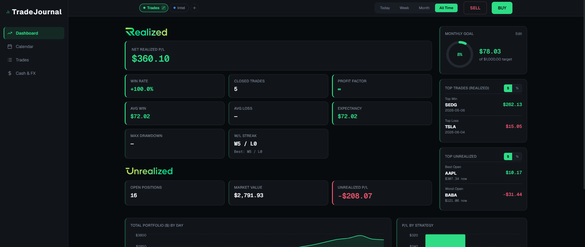
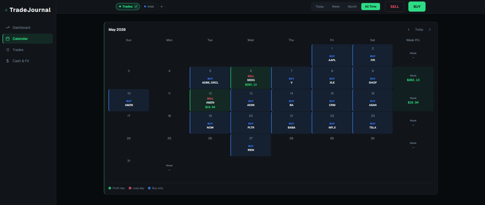
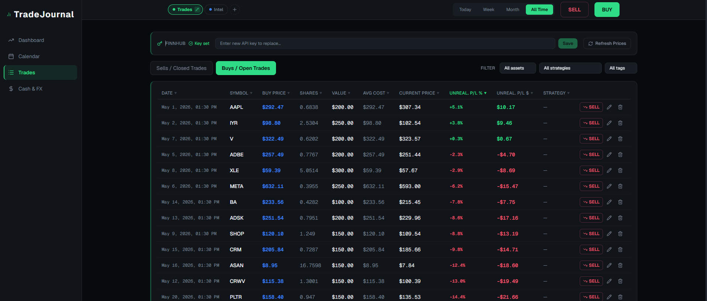
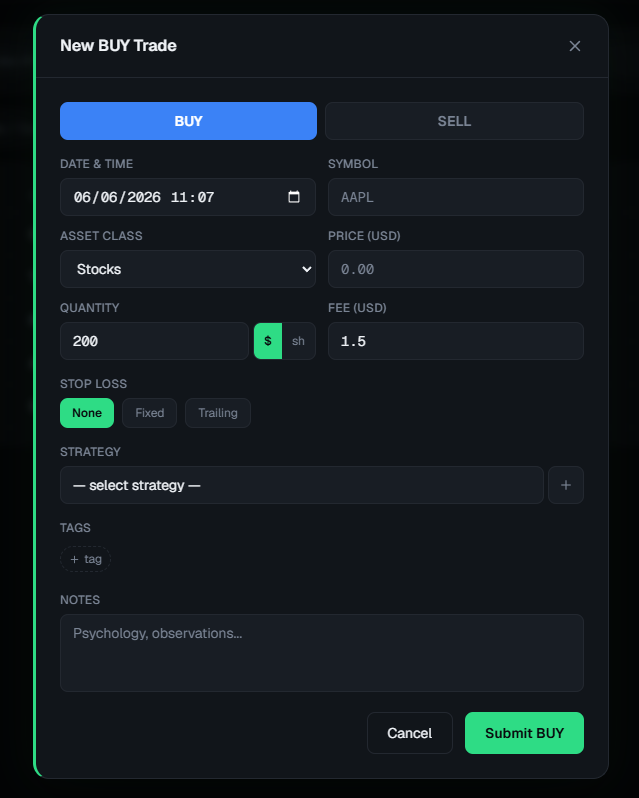
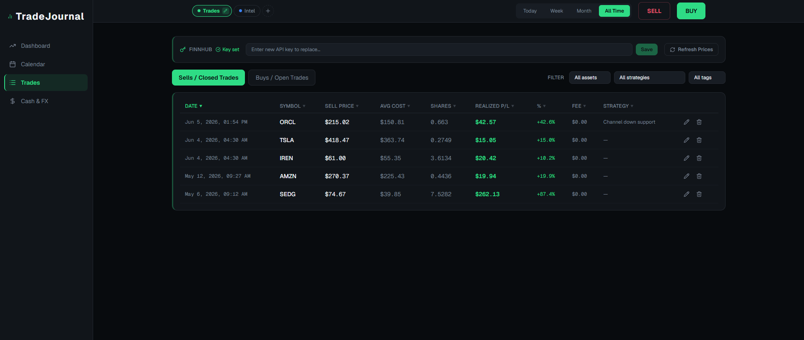
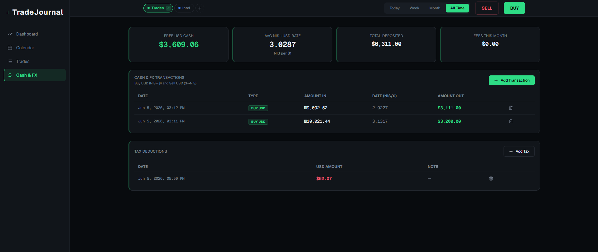

# TradeJournal

A clean, modern trading journal built for swing traders. Log trades, track realized and unrealized P&L, analyze performance across strategies — all running locally on your machine with live Finnhub prices.

No cloud. No subscription. Your data stays on your disk.

---

## Screenshots

| Dashboard | Calendar |
|-----------|----------|
|  |  |

| Open Trades | Trade Entry |
|-------------|-------------|
|  |  |

| Closed Trades | Cash & FX |
|---------------|-----------|
|  |  |

---

## Features

### Dashboard
- **Realized KPIs** — Net P&L, Win Rate, Profit Factor, Avg Win/Loss, Expectancy, Max Drawdown, Win/Loss streaks
- **Unrealized KPIs** — live market value and open P&L via Finnhub (auto-refreshes every 30s)
- **Monthly goal ring** — set a profit target, watch it fill as you close trades
- **Top Trades card** — best and worst closed trade (switchable $ / %)
- **Top Unrealized card** — best and worst open position by live price
- **Charts** — cumulative realized P&L over time, P&L by strategy, monthly P&L bar

### Calendar View
Full monthly calendar (week starts Sunday) showing:
- 🟢 Green day = net realized profit · 🔴 Red = net loss · 🔵 Blue = buys only, no sells
- Weekly P&L column on the right side of each row
- Prev / Next month navigation

### Trades — Open Positions
- Shows only positions that are **currently open** (sold positions disappear automatically)
- Live **current price**, **unrealized P&L %** and **$** per row
- **SELL button** on each row — opens the sell form pre-filled with that symbol
- Sortable by any column
- Finnhub API key input + manual **Refresh Prices** button

### Trades — Closed Trades
- Every completed sell with realized P&L, sell price, avg cost, and fee
- Sortable by any column

### Trade Entry Form
- BUY / SELL toggle — or click the row-level SELL button to pre-fill the symbol
- **Dollar amount or shares** quantity mode (default $200)
- **Strategy** — dropdown built from your past trades + **+** button to add new
- **Tags** — toggleable pill buttons + **+** to add new
- Stop loss: None / Fixed price / Trailing %
- **Sell All** button — appears when selling a symbol you hold; fills in the exact share count so no rounding residue is left behind
- SELL form pre-fills strategy, tags, and notes from the matching BUY

### Cash & FX Panel
- Free USD cash balance: `deposits − buys + sells − fees − tax`
- NIS → USD deposit form (enter NIS amount + today's rate)
- Weighted **average buy rate** shown prominently so you never lose on the conversion
- Manual tax deduction
- Monthly fee total

### Multiple Portfolios
Create and switch between named portfolios — same layout, completely separate data.

---

## Tech Stack

- **Frontend** — React 18, TypeScript, Vite, Tailwind CSS, Recharts, lucide-react
- **Backend** — Node.js, Express, TypeScript
- **Persistence** — `journal.json` (source of truth) + auto-mirrored `journal.csv`
- **Live prices** — Finnhub API, proxied through the backend (API key never touches the browser)

---

## Installation

### Prerequisites (one-time installs)

| Tool | Where to get it |
|------|----------------|
| **Node.js** (LTS) | [nodejs.org](https://nodejs.org) |
| **Git** | [git-scm.com](https://git-scm.com) |

Install both with default options. That's all you need.

---

### Step 1 — Download & install

Open a terminal (`Win + R` → type `cmd` → Enter) and run:

```bash
git clone https://github.com/deanamzaleg/TradeJournal.git
cd TradeJournal
npm install
```

`npm install` downloads all dependencies — takes about 30 seconds.

---

### Step 2 — Get a Finnhub API key

1. Go to **[finnhub.io](https://finnhub.io)** → click **Sign Up** (free, no credit card)
2. After login → **Dashboard** → copy the API key shown there (looks like `d8hbet1r...`)

**Set the key in two ways — pick one:**

**Option A — via the app (easiest):**
Start the app first, go to the **Trades** tab, find the Finnhub bar at the top, paste your key, click **Save**. Done. The key is stored locally on your machine, never sent back to the browser.

**Option B — via `.env` file:**
Create a file named `.env` in the `TradeJournal` folder:
```
FINNHUB_API_KEY=paste_your_key_here
PORT=5174
DATA_DIR=./data
```

---

### Step 3 — Run

```bash
npm run dev
```

Then open your browser:
```
http://localhost:5173
```

Leave the terminal window open — closing it stops the app.

---

### Step 4 — First-time setup in the app

1. You'll see **"Create your first portfolio"** → type a name (e.g. `Main Account`) → click **Create Portfolio**
2. Go to **Trades** tab → paste your Finnhub key in the top bar → click **Save** → click **Refresh Prices**
3. Click the green **BUY** button (top right) to log your first trade

---

## Daily use

| Action | How |
|--------|-----|
| Log a buy | **BUY** button (top right) |
| Close a position | **Trades → Open Trades** → click **SELL** on the row |
| View performance | **Dashboard** — switch period: Today / Week / Month / All Time |
| Browse history | **Calendar** view |
| Add cash deposit | **Cash & FX** tab → Add Cash |
| Export to Excel | Data auto-saves to `server/data/journal.csv` — open it any time |

---

## Where your data lives

```
TradeJournal/
  server/data/
    journal.json      ← source of truth (human-readable)
    journal.csv       ← auto-updated mirror, open in Excel anytime
    settings.json     ← stores your Finnhub key if entered via the UI
```

All files are local, git-ignored, and never leave your machine.

---

## Stop & restart

```bash
# Stop
Ctrl + C   (in the terminal)

# Start again
npm run dev
```

---

## All commands

```bash
npm run dev          # start backend + frontend together
npm run dev:server   # backend only  (port 5174)
npm run dev:web      # frontend only (port 5173)
npm run build        # type-check + production build
npm run lint         # ESLint
```

---

## How the position engine works

Trades are stored as individual fills — not entry/exit pairs — so you can scale in and out freely. Replaying all fills in time order gives a running **average cost** per symbol. A position is **open** when shares > 0, **closed** when it returns to zero.

**Realized P&L on a sell** = `(sellPrice − avgCost) × shares − fee`

**Period filter** (Today/Week/Month) filters KPIs by the *sell date*, not the buy date. This means average cost is always computed from all fills even when the buy happened before the selected period.

**Dollar-mode rounding** — buying $200 then selling $200 at a different price leaves a tiny share residue. Positions worth less than $0.05 are automatically zeroed out to avoid phantom open trades. Use the **Sell All** button to avoid this entirely.
